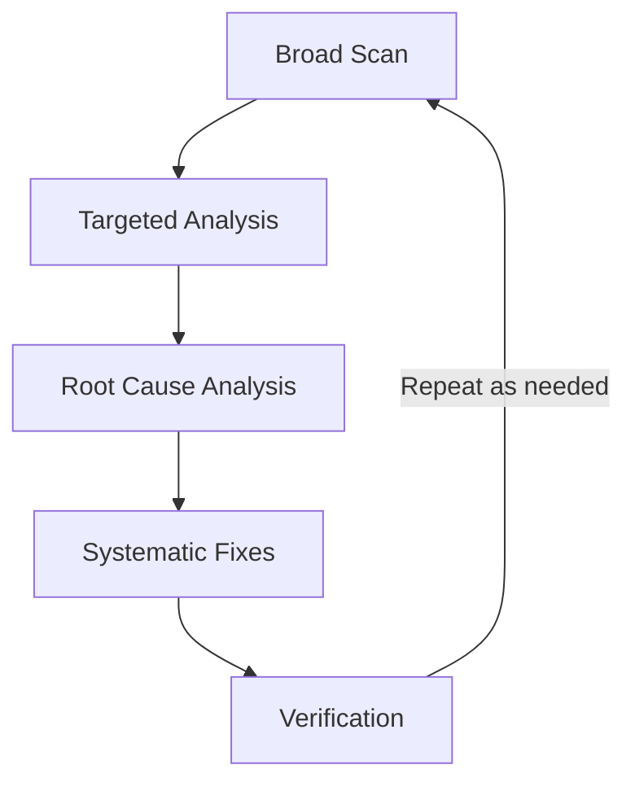

# TypeScript Best Practices: Lessons from Code Quality Fixes

This document captures key lessons learned from a coding session focused on improving TypeScript code quality by eliminating `any` types and non-null assertions.

## Executive Summary (TL;DR)

- **Avoid `any` types** and non-null assertions (`!`) to maintain type safety
- **Design function signatures** that work with TypeScript's type system rather than against it
- **Follow iterative workflow**: lint → analyze → fix → test → repeat
- **Key insight**: TypeScript's control flow narrowing doesn't persist across function boundaries
- **Result**: Eliminated 4 warnings while improving maintainability

## Overview

During a code quality improvement session, we addressed ESLint warnings about using `any` types in TypeScript code. The session involved analyzing warnings, understanding root causes, and implementing fixes that enhance type safety while maintaining functionality.

## Key Lessons Learned

### 1. TypeScript Best Practices

#### Avoid `any` Types

- **Problem**: Using `any` bypasses TypeScript's type checking, leading to potential runtime errors and reduced code maintainability.
- **Impact**: The session identified 56 warnings in the codebase related to `any` usage, indicating widespread type safety issues.
- **Solution**: Define proper interfaces and types for all data structures.
- **Benefits**: Compile-time error detection, better IDE support, improved code documentation.

#### Eliminate Non-Null Assertions (`!`)

- **Problem**: The `!` operator tells TypeScript to ignore null/undefined checks, masking real type safety issues.
- **Root Cause**: TypeScript's control flow analysis doesn't persist across function boundaries, even when runtime checks guarantee values exist.
- **Solution**: Restructure function signatures to accept required parameters instead of relying on assertions.
- **Benefits**: Safer code at compile time, reduced runtime errors, cleaner function APIs.
- **Example**: Instead of `processUser(args.user!)`, use `processUser(user: User)` and pass validated data.

#### Additional TypeScript Patterns

- **Use Generics for Flexibility**: Prefer `<T>` over `any` for reusable components while maintaining type safety.
- **Discriminated Unions**: Use union types with discriminant properties for exhaustive type checking.
- **Type Guards**: Implement custom functions like `isUser(obj: unknown): obj is User` for runtime validation.

### 2. Code Architecture Insights

#### Function Signature Design

- **Best Practice**: Pass individual required parameters instead of optional object properties.
- **Benefits**:
  - Better type safety at compile time
  - Clearer API contracts
  - Reduced need for runtime null checks
- **Trade-offs**: Longer parameter lists may require config objects for very complex functions (balance with readability). For functions with 6+ params, consider a required config object with Pick/Required utilities.

#### Control Flow Analysis Limitations

- **Understanding**: TypeScript narrows types within conditional blocks but doesn't maintain this narrowing across function calls.
- **Implication**: Even with `if (args.pattern)`, TypeScript still sees `pattern` as `string | undefined` inside called functions.
- **Recent Improvements**: TypeScript 5.x+ offers better narrowing with `satisfies` operator and improved alias preservation. Previews for the upcoming TypeScript 7.0 (native Go port, with deprecations starting in TS 6.0) have been available since mid-2025 and continue into 2026, promising significant performance improvements like 10x faster builds.

### 3. Development Workflow

#### Iterative Linting Process



This iterative process is particularly efficient with Bun's fast execution times, enabling rapid feedback cycles.

1. **Broad Scan**: Run full lint suite to identify all issues (`bun run lint`)
2. **Targeted Analysis**: Focus on specific files and warnings
3. **Root Cause Analysis**: Use search tools to understand code context
4. **Systematic Fixes**: Address one warning at a time with verification
5. **Verification**: Re-run lint, typecheck, and tests after each change

#### Quality Assurance Steps

- **Type Checking**: Always run `bun run typecheck` after TypeScript changes
- **Testing**: Execute both unit (`bun test`) and E2E tests (`bun run test:all`) to ensure functionality preservation
- **Type Testing**: Use libraries like [tsd](https://github.com/tsdjs/tsd) for type assertions in tests
- **Runtime Validation**: Combine static types with libraries like [Zod](https://zod.dev/) for API responses

### 4. Tool Usage Patterns

#### Code Analysis Tools

- **Grep**: Search for patterns across the codebase to understand usage context
- **Read**: Examine specific files to understand implementation details
- **Task Tool**: AI-powered agent for complex analysis and comprehensive reporting
- **IDE Integration**: Use VS Code's TypeScript extensions for inline type hints and quick fixes

#### Verification Tools

- **ESLint**: Identify code quality issues with [@typescript-eslint](https://typescript-eslint.io/) rules
- **TypeScript Compiler**: Catch type errors at compile time
- **Test Runners**: Ensure functionality remains intact after changes
- **CI/CD Tools**: GitHub Actions for automated type checking and linting

### 5. Error Prevention Strategies

#### Gradual Implementation

- **Approach**: Fix one warning at a time rather than attempting comprehensive changes
- **Benefits**: Easier verification, reduced risk of introducing new issues

#### Runtime vs Compile-Time Safety

- **Understanding**: TypeScript provides compile-time guarantees, but runtime validation is still necessary for dynamic data
- **Practice**: Use both static typing and runtime checks where appropriate

## Common Pitfalls

- **Over-typing**: Excessive generic constraints can make code verbose and hard to maintain
- **Legacy Migration**: Large existing codebases may require phased approaches to avoid breaking changes
- **Performance Impact**: Complex type computations can slow down TypeScript compilation
- **False Security**: Relying solely on types without runtime validation for external inputs
- **Ignoring Errors**: Using `@ts-ignore` as a last resort, with comments explaining why
- **Preview Adoption**: Test thoroughly before adopting unreleased features like TypeScript 7.0 native previews

## Case Study: PTY Read Tool Refactoring

### Original Issues

- Function `handlePatternRead` accepted `args: any` parameter
- Used `args.pattern!` with non-null assertion
- TypeScript couldn't verify `pattern` was defined despite conditional check

### Solution Implemented

```typescript
// Before
function handlePatternRead(args: any, session: any, offset: number, limit: number)

// After
function handlePatternRead(
  id: string,
  pattern: string, // Now required - no assertion needed
  ignoreCase: boolean | undefined, // Optional with clear default behavior
  session: PTYSessionInfo,
  offset: number,
  limit: number
)
```

### Benefits Achieved

- **Eliminated 4 ESLint warnings** (e.g., reduced session-specific warnings from 56 to 52)
- **Improved type safety** at compile time
- **Maintained runtime correctness** with existing tests
- **Enhanced code maintainability** through clearer APIs

## Recommendations for Future Development

### Immediate Actions

1. **Enable Strict Linting**: Configure `@typescript-eslint/no-non-null-assertion` rule
2. **Type Definition Audit**: Review interfaces for optional vs required properties
3. **Gradual Migration**: Address `any` types systematically across the codebase

### Long-term Architecture

1. **Discriminated Unions**: Use union types for different operation modes
2. **Schema Generation**: Consider tools like [zod-to-ts](https://github.com/sachinraja/zod-to-ts) for automatic type generation
3. **Type Guards**: Implement custom type guards for complex validation logic

### Development Practices

1. **Pre-commit Hooks**: Automate linting and type checking
2. **Code Reviews**: Include type safety checks in review criteria
3. **Documentation**: Maintain type definition documentation with JSDoc for better IDE support
4. **Team Training**: Educate developers on these patterns for consistent application

## Conclusion

This session demonstrated that systematic application of TypeScript best practices significantly improves code quality while maintaining functionality. The key insights focus on understanding TypeScript's type system limitations and designing code architecture that works with the type checker rather than against it.

**Next Steps**: Start by auditing your codebase for `any` usage with `grep -r ': any' src/` and apply these fixes incrementally. Track metrics like warning reduction and build time improvements to quantify the impact of type safety improvements. Monitor TS compile times with TypeScript 7.0 previews (install via `bun install -g @typescript/native-preview`) for the promised performance gains.
