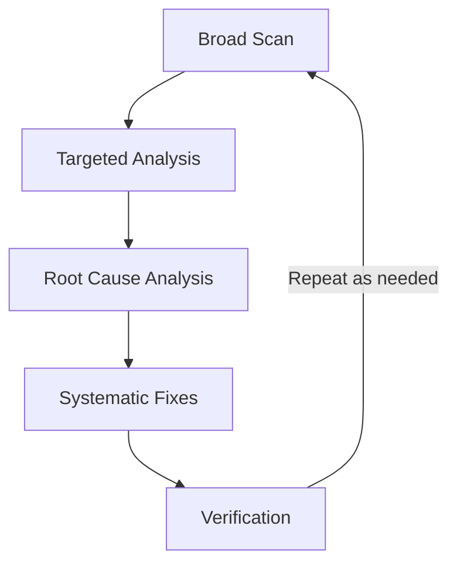

# TypeScript Best Practices: Core Principles

This document captures key lessons learned from multiple coding sessions focused on improving TypeScript code quality by eliminating `any` types, non-null assertions, and enhancing type safety in Bun-based projects with PTY management and E2E testing.

## Executive Summary (TL;DR)

- **Avoid `any` types** and non-null assertions (`!`) to maintain type safety
- **Design function signatures** that work with TypeScript's type system rather than against it
- **Follow iterative workflow**: lint → analyze → fix → test → repeat
- **Key insights**: TypeScript's control flow narrowing doesn't persist across function boundaries; module augmentation improves global object typing; E2E test timing is critical after type changes; Bun's WebSocket API evolution requires staying current with framework changes
- **Results**: Eliminated 11 total warnings across sessions (from 41 to 30), improved test reliability, and enhanced code maintainability

## Core Principles

### Avoid `any` Types

**Problem**: Using `any` bypasses TypeScript's type checking, leading to potential runtime errors and reduced code maintainability.

**Impact**: The session identified 41 warnings in the codebase related to `any` usage, indicating widespread type safety issues.

**Solution**: Define proper interfaces and types for all data structures.

**Benefits**: Compile-time error detection, better IDE support, improved code documentation.

### Eliminate Non-Null Assertions (`!`)

**Problem**: The `!` operator tells TypeScript to ignore null/undefined checks, masking real type safety issues.

**Root Cause**: TypeScript's control flow analysis doesn't persist across function boundaries, even when runtime checks guarantee values exist.

**Solution**: Restructure function signatures to accept required parameters instead of relying on assertions.

**Benefits**: Safer code at compile time, reduced runtime errors, cleaner function APIs.

**Example**: Instead of `processUser(args.user!)`, use `processUser(user: User)` and pass validated data.

### Additional TypeScript Patterns

- **Use Generics for Flexibility**: Prefer `<T>` over `any` for reusable components while maintaining type safety.
- **Discriminated Unions**: Use union types with discriminant properties for exhaustive type checking.
- **Type Guards**: Implement custom functions like `isUser(obj: unknown): obj is User` for runtime validation.

## Code Architecture Insights

### Function Signature Design

- **Best Practice**: Pass individual required parameters instead of optional object properties.
- **Benefits**:
  - Better type safety at compile time
  - Clearer API contracts
  - Reduced need for runtime null checks
- **Trade-offs**: Longer parameter lists may require config objects for very complex functions (balance with readability). For functions with 6+ params, consider a required config object with Pick/Required utilities.

### Control Flow Analysis Limitations

- **Understanding**: TypeScript narrows types within conditional blocks but doesn't maintain this narrowing across function calls.
- **Implication**: Even with `if (args.pattern)`, TypeScript still sees `pattern` as `string | undefined` inside called functions.
- **Recent Improvements**: TypeScript 5.x+ offers better narrowing with `satisfies` operator and improved alias preservation. Previews for the upcoming TypeScript 7.0 (native Go port, with deprecations starting in TS 6.0) have been available since mid-2025 and continue into 2026, promising significant performance improvements like 10x faster builds.

## Development Workflow

### Iterative Linting Process

This iterative process is particularly efficient with Bun's fast execution times, enabling rapid feedback cycles.

1. **Broad Scan**: Run full lint suite to identify all issues (`bun run lint`)
2. **Targeted Analysis**: Focus on specific files and warnings
3. **Root Cause Analysis**: Use search tools to understand code context
4. **Systematic Fixes**: Address one warning at a time with verification
5. **Verification**: Re-run lint, typecheck, and tests after each change

### Quality Assurance Steps

- **Type Checking**: Always run `bun run typecheck` after TypeScript changes
- **Testing**: Execute both unit (`bun test`) and E2E tests (`bun run test:all`) to ensure functionality preservation
- **Type Testing**: Use libraries like [tsd](https://github.com/tsdjs/tsd) for type assertions in tests
- **Runtime Validation**: Combine static types with libraries like [Zod](https://zod.dev/) for API responses

## Error Prevention Strategies

### Gradual Implementation

- **Approach**: Fix one warning at a time rather than attempting comprehensive changes
- **Benefits**: Easier verification, reduced risk of introducing new issues

### Runtime vs Compile-Time Safety

- **Understanding**: TypeScript provides compile-time guarantees, but runtime validation is still necessary for dynamic data
- **Practice**: Use both static typing and runtime checks where appropriate

## Common Pitfalls

- **Over-typing**: Excessive generic constraints can make code verbose and hard to maintain
- **Legacy Migration**: Large existing codebases may require phased approaches to avoid breaking changes
- **Performance Impact**: Complex type computations can slow down TypeScript compilation
- **False Security**: Relying solely on types without runtime validation for external inputs
- **Ignoring Errors**: Using `@ts-ignore` as a last resort, with comments explaining why
- **Preview Adoption**: Test thoroughly before adopting unreleased features like TypeScript 7.0 native previews

## Challenges in Type Safety Implementation

### E2E Test Integration

- Type changes revealed timing dependencies in test setup
- Required rebuilding web assets for test environment
- Highlighted importance of test-first validation for global state changes

### Type System Limitations

- Private properties require type compromises
- Dynamic property access in tests conflicts with strict typing
- Balance between type safety and practical implementation

### Tooling and Workflow

- Quality tools provide comprehensive feedback but require careful interpretation
- Build processes must be considered in test environments
- Incremental changes reduce risk but require more verification steps

## Related Documentation

For specific patterns and advanced techniques, see:

- **[TypeScript Patterns](patterns.md)**: WebSocket typing, global augmentation, and testing patterns
- **[Case Studies](case-studies.md)**: Real-world refactoring examples
